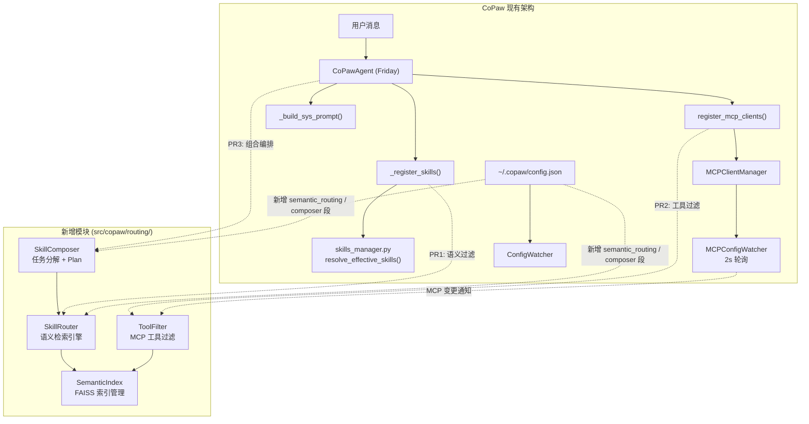

# 技术设计文档：CoPaw 语义技能路由与组合编排

## 概述

本设计在 CoPaw 的 `src/copaw/` 目录下原生实现语义技能路由和组合编排能力，核心算法借鉴 SkillWeaver（EMNLP 2026）的 embedding + FAISS 检索、token budget 过滤和任务分解方法论。

系统分为三个独立模块，按 3 个 PR 递进交付：

1. **Skill Router**（PR1）：在 `CoPawAgent._register_skills()` 流程中插入语义过滤层，用 sentence-transformers 编码 skill 描述 + FAISS 索引检索，只注入与用户查询相关的 skills
2. **MCP Tool Filter**（PR2）：复用 PR1 的检索基础设施，在 `CoPawAgent.register_mcp_clients()` 之后对 MCP 工具列表进行语义过滤，加入 token budget 和多样性控制
3. **Skill Composer**（PR3）：任务分解 + 子任务-skill 匹配 + Plan 生成，支持 rule/ollama/openai 三种分解后端

设计原则：
- 零侵入：所有功能默认关闭，未安装可选依赖时 CoPaw 行为完全不变
- 遵循 CoPaw 的 Pydantic config 模式，配置通过 `~/.copaw/config.json` 管理
- 不改动现有公开接口签名
- 与 CoPaw 的 ConfigWatcher 热重载机制兼容

## 架构

### 系统架构图



### 集成点详解

**PR1 集成点 — `_register_skills()`**：
在 `CoPawAgent._register_skills()` 中，`resolve_effective_skills()` 返回 effective_skills 列表后，插入语义过滤。SkillRouter 接收用户查询（从 `_request_context` 获取）和 skill 列表，返回过滤后的 skill 子集。只有过滤后的 skills 被 `toolkit.register_agent_skill()` 注册。

**PR2 集成点 — `register_mcp_clients()`**：
在 `CoPawAgent.register_mcp_clients()` 完成所有 MCP client 注册后，ToolFilter 对 toolkit 中已注册的 MCP 工具列表进行语义过滤。过滤逻辑在工具列表传递给 agent 之前执行，不修改 MCPClientManager 或 MCPConfigWatcher 的接口。

**PR3 集成点 — agent 查询入口**：
在 CoPawAgent 处理用户消息时，如果 `composer.enabled` 为 true，SkillComposer 先对用户消息进行任务分解，为每个子任务匹配 skill，生成 Plan 对象。Plan 信息作为增强上下文注入到 agent 的 system prompt 中。

## 组件与接口

### 模块结构

```
src/copaw/routing/
├── __init__.py          # 公开 API + 延迟导入守卫
├── config.py            # SemanticRoutingConfig, ComposerConfig (Pydantic)
├── index.py             # SemanticIndex — FAISS 索引构建/持久化/查询
├── router.py            # SkillRouter — 语义 skill 检索
├── filter.py            # ToolFilter — MCP 工具过滤 (token budget + diversity)
├── composer.py          # SkillComposer — 任务分解 + Plan 生成
├── decomposers.py       # RuleDecomposer, LLMDecomposer
└── models.py            # RoutingResult, FilterResult, Plan, PlanStep 等数据模型
```

### 核心接口

#### SemanticIndex（index.py）

```python
class SemanticIndex:
    """FAISS 索引管理器，负责 embedding 编码、索引构建和持久化。"""

    def __init__(self, encoder_name: str = "all-MiniLM-L6-v2",
                 persist_dir: Path | None = None):
        ...

    def build(self, items: list[IndexItem]) -> None:
        """从 IndexItem 列表构建 FAISS 索引。"""

    def search(self, query: str, top_k: int = 10) -> list[SearchHit]:
        """语义检索，返回 top_k 个最相关的结果。"""

    def save(self) -> None:
        """持久化索引到 persist_dir。"""

    def load(self) -> bool:
        """从 persist_dir 加载索引，成功返回 True。"""

    def needs_rebuild(self, items: list[IndexItem]) -> bool:
        """检查当前索引是否与 items 一致（通过哈希比对）。"""
```

#### SkillRouter（router.py）

```python
class SkillRouter:
    """语义 skill 检索引擎。"""

    def __init__(self, config: SemanticRoutingConfig):
        ...

    def route(self, query: str, skills: list[SkillInfo]) -> RoutingResult:
        """对 skill 列表进行语义过滤，返回与 query 最相关的 skills。
        当 len(skills) <= top_k 时直接返回全部。"""

    def invalidate(self) -> None:
        """标记索引需要重建（skill 变更时调用）。"""
```

#### ToolFilter（filter.py）

```python
class ToolFilter:
    """MCP 工具语义过滤器，支持 token budget 和多样性控制。"""

    def __init__(self, config: SemanticRoutingConfig):
        ...

    def filter(self, query: str, tools: list[ToolInfo],
               mandatory: list[str] | None = None) -> FilterResult:
        """对 MCP 工具列表进行语义过滤。
        mandatory 中的工具始终包含。
        单个 server 的工具数不超过 max_tools // 3（向上取整，最小 3）。
        总 token 数不超过 token_budget。"""
```

#### SkillComposer（composer.py）

```python
class SkillComposer:
    """任务分解 + skill 匹配 + Plan 生成。"""

    def __init__(self, config: ComposerConfig, router: SkillRouter):
        ...

    def compose(self, query: str, skills: list[SkillInfo]) -> Plan:
        """将复杂任务分解为子任务，为每个子任务匹配 skill，生成 Plan。"""
```

### 延迟导入守卫（__init__.py）

```python
# src/copaw/routing/__init__.py
_AVAILABLE = False
try:
    import sentence_transformers  # noqa: F401
    import faiss                  # noqa: F401
    _AVAILABLE = True
except ImportError:
    pass

def is_routing_available() -> bool:
    return _AVAILABLE
```

所有对 `sentence_transformers` 和 `faiss` 的 import 都在运行时延迟执行（在 `SemanticIndex` 的方法内部），确保未安装时不产生 ImportError。

## 数据模型

### 配置模型（Pydantic，遵循 CoPaw 模式）

```python
class SemanticRoutingConfig(BaseModel):
    """语义路由配置，对应 config.json 中的 semantic_routing 段。"""
    model_config = ConfigDict(extra="ignore")

    enabled: bool = Field(default=False, description="是否启用语义路由")
    encoder: str = Field(default="all-MiniLM-L6-v2", description="embedding 模型名称")
    top_k: int = Field(default=10, description="skill 检索数量")
    max_tools: int = Field(default=20, description="MCP 工具过滤上限")
    token_budget: int = Field(default=8000, description="工具描述 token 预算")
    mandatory_tools: list[str] = Field(default_factory=list, description="始终包含的工具名称")


class ComposerConfig(BaseModel):
    """组合编排配置，对应 config.json 中的 composer 段。"""
    model_config = ConfigDict(extra="ignore")

    enabled: bool = Field(default=False, description="是否启用组合编排")
    backend: str = Field(default="rule", description="分解后端: rule | ollama | openai")
```

这两个配置类将作为字段添加到 CoPaw 的 `Config` 根模型中：

```python
class Config(BaseModel):
    # ... 现有字段 ...
    semantic_routing: SemanticRoutingConfig = Field(
        default_factory=SemanticRoutingConfig
    )
    composer: ComposerConfig = Field(
        default_factory=ComposerConfig
    )
```

### 索引数据模型

```python
@dataclass
class IndexItem:
    """索引条目，统一表示 skill 和 MCP 工具。"""
    id: str                    # 唯一标识
    name: str                  # skill/tool 名称
    description: str           # 描述文本（用于 embedding）
    source: str                # "skill_pool" | "mcp:{server_name}"
    metadata: dict[str, Any] = field(default_factory=dict)


@dataclass
class SearchHit:
    """检索结果条目。"""
    item: IndexItem
    score: float               # 相似度分数，0.0 ~ 1.0
```

### 路由结果模型

```python
@dataclass
class RoutingResult:
    """Skill 语义检索结果。"""
    hits: list[SearchHit]      # 匹配的 skills
    query: str                 # 原始查询
    total_skills: int          # Skill_Pool 中的总 skill 数
    bypassed: bool             # True 表示 skills 数 <= top_k，跳过了检索

    def to_dict(self) -> dict[str, Any]: ...

    def to_json(self) -> str: ...

    @classmethod
    def from_json(cls, json_str: str) -> "RoutingResult": ...


@dataclass
class FilterResult:
    """MCP 工具过滤结果。"""
    selected_tools: list[SearchHit]   # 选中的工具
    total_tools: int                  # 过滤前的工具总数
    token_estimate: int               # 选中工具的估算 token 数
    query: str                        # 原始查询

    def to_dict(self) -> dict[str, Any]: ...

    def to_json(self) -> str: ...

    @classmethod
    def from_json(cls, json_str: str) -> "FilterResult": ...
```

### Plan 模型

```python
@dataclass
class PlanStep:
    """Plan 中的一个步骤。"""
    step_index: int
    description: str           # 子任务描述
    skill_name: str | None     # 匹配的 skill 名称，None 表示 unresolved
    confidence: float          # 匹配置信度，0.0 ~ 1.0
    parallel_group: int | None = None  # 并行分组，同组可并行执行
    status: str = "pending"    # "pending" | "unresolved"


@dataclass
class Plan:
    """完整的执行计划。"""
    query: str
    steps: list[PlanStep] = field(default_factory=list)

    @property
    def num_steps(self) -> int: ...

    @property
    def avg_confidence(self) -> float: ...

    def to_dict(self) -> dict[str, Any]: ...

    def to_json(self) -> str: ...

    @classmethod
    def from_dict(cls, d: dict[str, Any]) -> "Plan": ...

    @classmethod
    def from_json(cls, json_str: str) -> "Plan": ...
```

### 索引持久化格式

持久化目录 `~/.copaw/semantic_index/`：
- `index.faiss` — FAISS 索引二进制文件
- `metadata.json` — IndexItem 列表 + 内容哈希（用于一致性检测）

```json
{
  "version": 1,
  "content_hash": "sha256:abc123...",
  "encoder": "all-MiniLM-L6-v2",
  "items": [
    {"id": "skill:git-commit", "name": "git-commit", "description": "...", "source": "skill_pool"},
    {"id": "mcp:filesystem:read_file", "name": "read_file", "description": "...", "source": "mcp:filesystem"}
  ]
}
```

`content_hash` 基于所有 items 的 `(id, name, description)` 三元组排序后计算 SHA-256，用于快速判断索引是否需要重建。


## 正确性属性

*属性（Property）是一个在系统所有有效执行中都应成立的特征或行为——本质上是对系统应做什么的形式化陈述。属性是人类可读规格说明与机器可验证正确性保证之间的桥梁。*

以下属性经过合并去重，每个属性提供独立的验证价值。

### Property 1: 索引构建保留所有条目

*For any* 有效的 IndexItem 集合（包含 skill_pool 和 mcp 来源的条目），构建 FAISS 索引后，索引中的条目总数应等于输入集合的大小，且每个条目的 source 字段应被正确保留。

**Validates: Requirements 1.1.1, 2.1.1, 2.1.2**

### Property 2: 内容变更触发索引重建

*For any* 已构建的 SemanticIndex 和任意对 IndexItem 集合的变更操作（新增、删除或修改条目的 description），`needs_rebuild()` 应返回 True。对于未变更的集合，应返回 False。

**Validates: Requirements 1.1.3**

### Property 3: 检索结果不变量

*For any* 查询字符串和包含至少一个条目的索引，`search(query, top_k)` 返回的结果应满足：(a) 结果数量 ≤ min(top_k, 索引总条目数)，(b) 结果按 score 降序排列，(c) 每个 SearchHit 的 score 在 [0.0, 1.0] 范围内，(d) 每个 SearchHit 的 item.name 和 item.description 非空。

**Validates: Requirements 1.2.1, 1.2.3**

### Property 4: 小规模 Skill 池旁路

*For any* skill 集合，当 `len(skills) <= top_k` 时，`SkillRouter.route()` 应返回全部 skills 且 `bypassed` 标志为 True，不执行向量检索。

**Validates: Requirements 1.2.4**

### Property 5: RoutingResult 序列化 Round-Trip

*For any* 有效的 RoutingResult 对象（包含任意数量的 SearchHit、任意 Unicode 字符的 name/description、任意 score 值），`RoutingResult.from_json(result.to_json())` 应产生与原始对象等价的结果。

**Validates: Requirements 1.5.1, 1.5.2, 1.5.3, 1.5.4**

### Property 6: 工具过滤三重约束

*For any* 查询字符串和 MCP 工具集合，`ToolFilter.filter()` 返回的结果应同时满足：(a) 选中工具数 ≤ max_tools，(b) 选中工具的估算 token 总数 ≤ token_budget，(c) 来自同一 MCP server 的工具数 ≤ ceil(max_tools / 3)（最小为 3）。

**Validates: Requirements 2.2.1, 2.2.2, 2.2.3**

### Property 7: Mandatory 工具始终包含

*For any* 工具集合和 mandatory_tools 列表，当 mandatory_tools 中的工具存在于工具集合中时，`ToolFilter.filter()` 的结果应始终包含这些工具，不受 top_k 排名限制。

**Validates: Requirements 2.2.4**

### Property 8: 任务分解产生有效子任务

*For any* 非空任务描述字符串，`RuleDecomposer.decompose()` 应产生至少 1 个子任务，每个子任务的 description 非空。对于包含已知连接词模式（"先...然后..."、"and then"、逗号分隔）的输入，应产生多于 1 个子任务。

**Validates: Requirements 3.1.1, 3.1.3**

### Property 9: Plan 结构完整性

*For any* 子任务列表和 skill 集合，`SkillComposer.compose()` 生成的 Plan 应满足：(a) Plan.steps 的数量等于子任务数量，(b) 每个 PlanStep 包含非空的 description，(c) 每个 PlanStep 的 confidence 在 [0.0, 1.0] 范围内，(d) 非 unresolved 的步骤包含非空的 skill_name。

**Validates: Requirements 3.2.1, 3.2.2**

### Property 10: 低置信度阈值标记

*For any* 子任务，当其最高匹配 skill 的相似度分数 < 0.3 时，对应的 PlanStep 应被标记为 `status="unresolved"` 且 `skill_name=None`。

**Validates: Requirements 3.2.4**

### Property 11: Plan 序列化 Round-Trip

*For any* 有效的 Plan 对象（包含任意数量的 PlanStep、任意 Unicode 字符、任意 parallel_group 值和 confidence 分数），`Plan.from_json(plan.to_json())` 应产生与原始对象等价的结果。

**Validates: Requirements 3.3.1, 3.3.2, 3.3.3, 3.3.4**

## 错误处理

### 依赖缺失

| 场景 | 处理方式 |
|------|---------|
| `sentence-transformers` 未安装 | `is_routing_available()` 返回 False，所有路由功能回退到原有逻辑 |
| `faiss-cpu` 未安装 | 同上 |
| `enabled=True` 但依赖缺失 | 记录 WARNING 日志（含 `pip install copaw[semantic]` 提示），自动回退 |

### 模型加载失败

| 场景 | 处理方式 |
|------|---------|
| embedding 模型下载超时 | 记录 WARNING，SkillRouter 回退到全量 skill 注入 |
| 模型文件损坏 | 同上 |
| HuggingFace 不可达 | 尝试 HF mirror，仍失败则回退 |

### 索引异常

| 场景 | 处理方式 |
|------|---------|
| 持久化索引文件损坏 | 删除旧文件，触发全量重建 |
| 持久化目录无写权限 | 记录 WARNING，索引仅保留在内存中（不持久化） |
| 索引与 Skill_Pool 不一致 | 自动触发全量重建 |

### Composer 后端异常

| 场景 | 处理方式 |
|------|---------|
| Ollama 服务不可用 | 记录 WARNING，回退到 `rule` 后端 |
| OpenAI API 调用失败 | 记录 WARNING，回退到 `rule` 后端 |
| LLM 返回非法 JSON | 记录 WARNING，回退到 `rule` 后端 |

### MCP 工具异常

| 场景 | 处理方式 |
|------|---------|
| 工具定义缺少 description | 使用 tool name 作为 fallback 文本，记录 INFO |
| MCP server 断连 | 不影响已有索引，下次 watcher 检测到变更时更新 |

所有错误处理遵循 "fail-open" 原则：任何新功能的异常都不应阻止 CoPaw 的正常运行，而是静默回退到原有行为。

## 测试策略

### 测试框架

- 单元测试：pytest（CoPaw 现有框架）
- 属性测试：Hypothesis（Python PBT 标准库）
- Mock：unittest.mock + pytest-mock
- 可选依赖跳过：`pytest.importorskip("sentence_transformers")` / `pytest.importorskip("faiss")`

### 双轨测试方法

**单元测试**（example-based）：
- 配置默认值验证（SemanticRoutingConfig、ComposerConfig 字段和默认值）
- 回退行为（依赖缺失、模型加载失败、服务不可用）
- 边界条件（空 skill 列表、损坏的索引文件、缺少 description 的工具）
- 集成点（ConfigWatcher 热重载、MCPConfigWatcher 变更通知）

**属性测试**（property-based，Hypothesis）：
- 每个属性测试至少 100 次迭代
- 每个测试用注释标注对应的设计属性
- 标注格式：`# Feature: skillweaver-copaw-integration, Property {N}: {title}`
- 生成器需覆盖 Unicode 字符、空字符串边界、大规模数据集

### PR 级测试分配

**PR1（语义 Skill 过滤）测试**：
- Property 1（索引构建）、Property 2（变更检测）、Property 3（检索不变量）、Property 4（小池旁路）、Property 5（RoutingResult round-trip）
- 单元测试：配置默认值、回退行为、索引持久化加载

**PR2（MCP 工具过滤）测试**：
- Property 6（三重约束）、Property 7（mandatory 工具）
- 单元测试：缺少 description 的 fallback、禁用时的 passthrough

**PR3（组合编排）测试**：
- Property 8（任务分解）、Property 9（Plan 结构）、Property 10（低置信度阈值）、Property 11（Plan round-trip）
- 单元测试：后端回退、配置默认值、并行分组

### 测试文件结构

```
tests/
├── test_routing/
│   ├── test_index.py        # Property 1, 2 + 索引持久化单元测试
│   ├── test_router.py       # Property 3, 4 + 回退单元测试
│   ├── test_filter.py       # Property 6, 7 + MCP 工具单元测试
│   ├── test_composer.py     # Property 8, 9, 10 + 后端回退单元测试
│   ├── test_models.py       # Property 5, 11 (round-trip)
│   └── test_config.py       # 配置默认值 + 热重载单元测试
```

### CI 集成

- 所有测试通过 CoPaw 现有的 `pytest` CI 流水线运行
- 需要可选依赖的测试使用 `pytest.importorskip` 自动跳过
- 代码风格通过 CoPaw 的 `pre-commit`（flake8 + black + isort）检查
